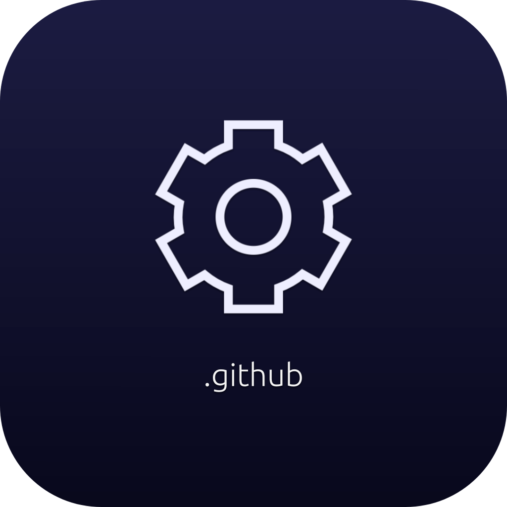
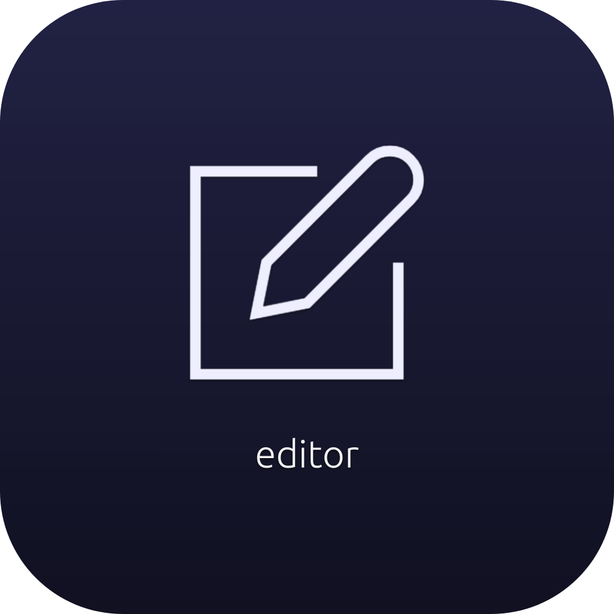
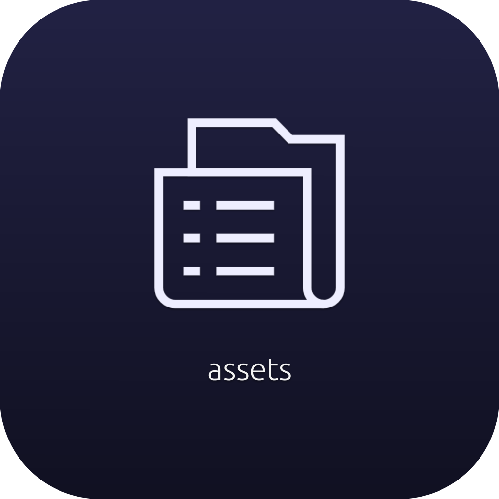

# holorhysm

カバー株式会社が運営するVtuber事務所「hololive production」をテーマにした、**非公式**のリズムゲームです。  
(いわゆる"ファンメイド"です。)

---

## リポジトリ

    
    
    
    
    
    
    

## 遊び方

- [https://holorhysm.axtech.dev/play/](https://holorhysm.axtech.dev/play/)を開きます。
- 必要に応じて、PWAとしてインストールすることができます。
    - インストール方法について、Chromeの場合は[こちら](https://support.google.com/chrome/answer/9658361)を参照。
    - インストール方法について、Safariの場合は[こちら](https://support.apple.com/ja-jp/guide/iphone/iph42ab2f3a7/ios#iph4f9a47bbc)を参照。

> 今後、URLが変更になる可能性があります。(時期・詳細未定)

## クレジット

- システム
    - Copyright (c) 2023- Ayasaka-Koto
        - Twitter(𝕏) : [@AyaKoto_info](https://twitter.com/AyaKoto_info)
- 譜面
    - Copyright (c) 2023- holorhysm charter team
        - Twitter(𝕏) : [@holorhysm_dev](https://twitter.com/holorhysm_dev)
        - チームメンバーは[Twitterのリスト](https://twitter.com/i/lists/1696356193327804694)を参照
- その他
    - Respecting Cover corp.
        - このゲームは、カバー株式会社運営のVtuber事務所「hololive production」をテーマにしています。
        - [hololive production 二次創作ガイドライン](https://hololivepro.com/terms/)を遵守するよう努めています。
            - 万が一ガイドラインに抵触する事項の指摘を受けた場合は、可能な限り迅速に対応します。
    - Powered by "Cloudflare Pages"
        - holorhysm本体はCloudflare Pagesによってホスティングされています。

## 利用規約

ファイルの利用 or プレイ開始を持ってこの規約に同意したとみなします。

- システムファイル
    - 原則、非営利目的かつ"世界に優しい使い方"なら、自由に使用して構いません。
    - このシステムの全体または大部分を翻案する場合は、可能な限りholorhysmを元にしていることを明記してください。
- 譜面ファイル
    - 原則、原作譜面を一切改変せずに二次配布することを禁じます。
    - 原作者(権利者)表記をファイル内に記載すれば、原作譜面を改変したものの二次配布ができます。ただし、非営利目的に限ります。
- holorhysmを遊ぶ場合
    - 実況プレイなどの配信(動画投稿など)について、私達があなたに悪意を見出さない限り、holorhysm開発チームが公開停止や中止を求めることはありません。
        - ただし、[hololive production 二次創作ガイドライン](https://hololivepro.com/terms/)に注意してください。
    - 広告や投げ銭などで収入を得る場合は、必ず概要欄にクレジット表記をお願いします。クレジット表記がない場合、私達はそこに悪意を見出します。
        - クレジット表記には、"holorhysm"と"[https://github.com/holorhysm](https://github.com/holorhysm)"を表記する必要があります。
            - 例 : `Now playing : "holorhysm" - https://github.com/holorhysm`
    - いずれかのSNSで、登録者・フォロー者数が20万を超えている人は、可能な限り事前に許諾が必要です。
        - 連絡先は`ayagawap@gmail.com`・Twitterの`@AyaKoto_info`or`@holorhysm_dev`です。
        - 可能な限り迅速に返信しますが、48時間経っても返信がなければ許可を得たとみなして構いません。
        - 対象者が事務所に所属する場合、事務所が連絡を代理しても構いません。
- 創作譜面を作る場合
    - 非営利なら別に勝手に作って公開していただいていいのですが、どうせなら**公式譜面作りませんか？**
    - [譜面制作メンバーは随時募集しています](https://note.com/axt_ayakoto/n/ne5fe9a5cc93d)。
